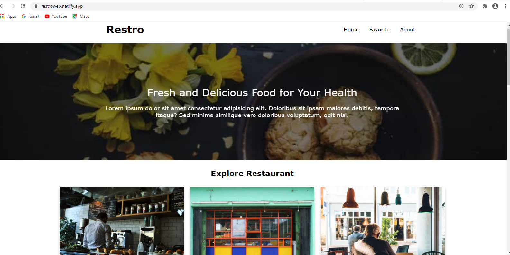

# Submission Dicoding - Menjadi Front-End Web Developer Expert

  

Website provides information about the restaurant

## Feature
* Single page apps
* Add favorite restaurant
* Delete favorite restaurant
* Add new review
* Accessed offline

## Demo

    

## Build With
- [Webpack](https://webpack.js.org/)
- [PWA](https://developers.google.com/web/progressive-web-apps)
- [IndexedDB](https://developers.google.com/web/ilt/pwa/working-with-indexeddb)
- [HTML](https://www.w3schools.com/html/)
- [CSS](https://www.w3schools.com/css/)
- [JS](https://www.javascript.com/)

##### tags: `Dicoding` `PWA` `Webpack` `ES6`